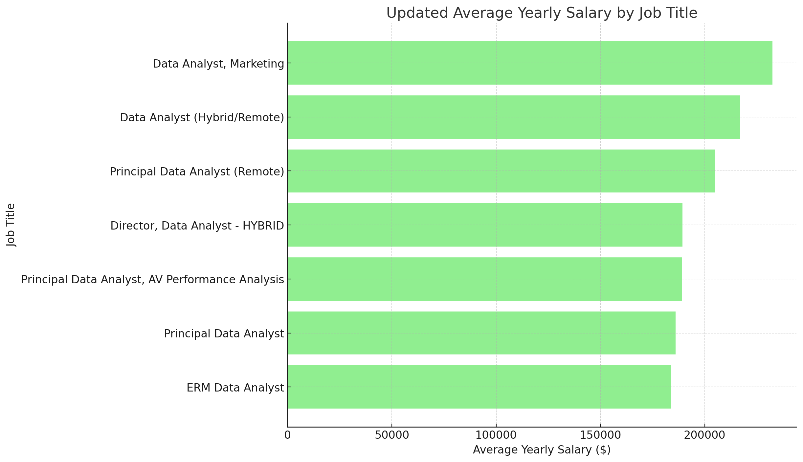

# Introduction
Dive into the data job market. Focusing on data  roles, this project explores top-paying jobs, in-demand skills, and where high demand meets high salary in data.

SQL queries? Check them out here: [project_sql folder](/project_sql/).

# Background
Driven by a quest to understand the labor market, this project was developed to pinpoint top-paid and in-demand skills, streamlining others' work to find optimal jobs.

### The questions we want to answer through my SQL queries were:

1. What are the top-paying data analyst jobs?
2. What skills are required for these top-paying jobs?
3. What skills are most in demand for data analysts?
4. Which skills are associated with higher salaries?
5. What the most optimal skills to learn?

# Tools I Used
For our deep dive into the data job market, we harnessed the power of several key tools:

- **SQL:** The backbone of our analysis, allowing me to query the database and unearth critical insights.
- **PostgreSQL & SQLite:** The chosen database management system, ideal for handling the job posting data.
- **Linux:** Commandeered the macOS terminal command line, to use the default shell bash/zsh to download Homebrew, Git and dependencies.
- **Git & GitHub:** Essential for version control and sharing our SQL queries and analysis, ensuring collaboration and project tracking.
- **Visual Studio Code:** Our go-to code-editor/IDE for database management and executing SQL queries.

# The Analysis
Each query for this project aimed at investigating specific aspects of the data analyst job market. Here's how I approached each question:

### 1. Top Paying Data Jobs
To identify the highest-paying roles, I filtered data positions by average yearly salary and location, focusing on remote jobs. This query highlights the high paying opportunities in the field.

```sql
SELECT
    job_id,
    job_title,
    job_location,
    job_schedule_type,
    salary_year_avg,
    job_posted_date,
    company_dim.name As company_name
FROM
    job_postings_fact
LEFT JOIN company_dim ON job_postings_fact.company_id = company_dim.company_id
WHERE
    job_title_short = 'Data Analyst' AND job_location = 'Anywhere' AND
    salary_year_avg IS NOT NULL
ORDER BY
    salary_year_avg DESC
LIMIT 10
```
Here's the breakdown of the job data analyst jobs in 2023:
- **Wide Salary Range:** Top 10 paying data analyst roles span from $184,000 to $650,000, indicating significant salary potential in the field.
- **Diverse Employers:** Companies like SmartAsset, Meta, and AT&T are among those offering high salaries, showing a broad interest across different industries.
- **Job Title Variety:** There's a high diversity in job titles, from Data Analyst to Director of Analytics, reflecting varied roles and specializations within data analytics.



# What I Learned

Through this research, I've refined my SQL skills to extract insights from structured data.

- **Complex Query Crafting:** Improved my SQL of merging tables and using WITH clauses on CTEs and using SubQueries.
- **DATA Aggregation:** Used the GROUP BY reserved word/phrase and turned aggregate functions like COUNT() and AVG() into effective data-summarizing tools.
- **Research Mindset:** Improved my real-world puzzle-solving skills, turning questions into actionable, insightful SQL queries.

# Conclusions
### Insights
1. **Top-Paying Data Analyst Jobs**: The highest-paying jobs for data analysts that allow remote work offer a wide range of salaries, the highest at $650,000.
2. **Skills for Top-Paying Jobs**: High-paying data jobs require advanced proficiency in SQL, suggesting it's a critical skill for earning a top salary.
3. **Most In-Demand Skills**: SQL is also the most demanded skill in the data labor market, thus making it essential for job seekers.
4. **Skills with Higher Salaries**: Specialized skills, such as Kafka and PySpark, are associated with highest average salaries, indicating a premium on niche expertise.
5. **Optimal Skills for Job Market Value**: SQL leads in demand and offers for a high average salary, positioning it as one of the most optimal skills for data analysts to learn to maximize their market value.

### Closing Thoughts

This research project enhanced my SQL skills and provided valuable insights into the data labor market. The findings from the analysis serve as a guide to prioritizing skill development and job search efforts. Aspiring data professionals can better position themselves in a competitive job market by focusing on high-demand, high-salary skills. This exploration highlights the importance of continuous learning and adaptation to emerging trends in the field of data.
